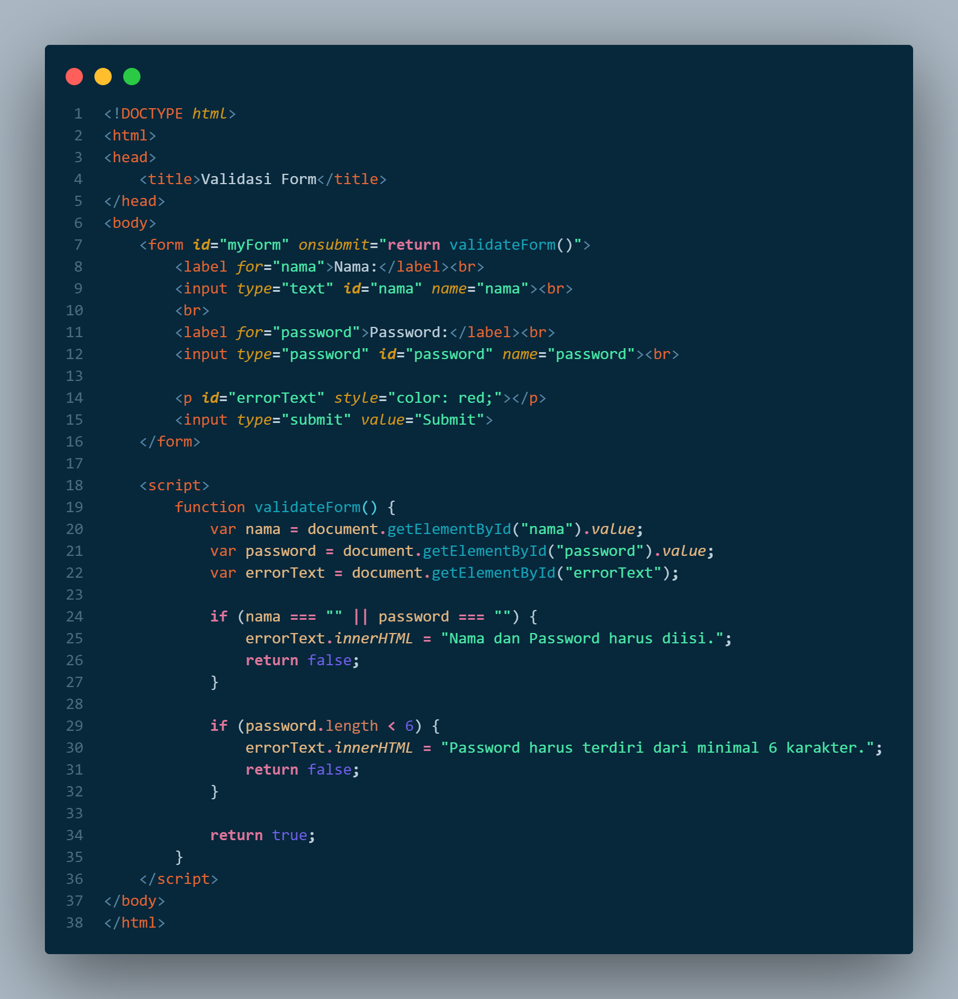
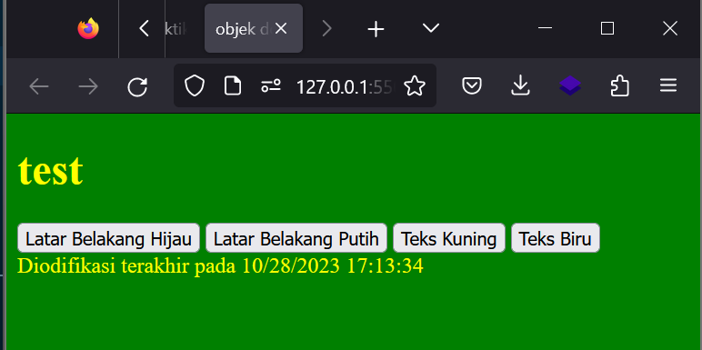

# Lab5Web
## Praktikum-5
### Tugas dan Pertanyaan
- Buat script Javascript untuk validasi isian form


        Saya membuat dua buah fungsi :
        - fungsi pertama untuk memvalidasi jika nama dan password tidak di isi
        - fungsi kedua untuk memvalidasi panjang password minimal 6 angka

- Hasilnya 


### Langkah-Langkah Praktikum
#### Membuat dokumen HTML dengan nama lab5_javascript.html
```
<!DOCTYPE html>
<html lang="en">
<head>
    <title>Mengenal JavaScript</title>
</head>
<body>
    <h1>Pengenalan JavaScript</h1>
    <h3>Contoh document.write dan console.log</h3>
    <script>
        document.write("Hello World");
        console.log("Hello World");
    </script>
</body>
</html>
```
- Hasilnya<br>

#### Pemakaian alert sebagai property window
```
<!DOCTYPE html>
<html lang="en">
<head>
    <meta charset="UTF-8">
    <meta name="viewport" content="width=device-width, initial-scale=1.0">
    <title>alert box</title>
</head>
<body>
    <script language="javascript">
     window.alert("ini merupakan pesan untuk anda");
    </script>
</body>
</html>
```
- Hasilnya<br>

#### Pemakaian Method dalam objek
```
<!DOCTYPE html>
<html lang="en">
<head>
    <meta charset="UTF-8">
    <meta name="viewport" content="width=device-width, initial-scale=1.0">
    <title>skrip javascript</title>
</head>
<body>
    <script language="javascript">
    document.write("selamat mencoba javascript");
    document.write("semoga sukses");
    </script>
</body>
</html>
```
- Hasilnya<br>

#### Pemakaian Prompt
```
<!DOCTYPE html>
<html lang="en">
<head>
    <meta charset="UTF-8">
    <meta name="viewport" content="width=device-width, initial-scale=1.0">
    <title>pemasukan data</title>
</head>
<body>
    <script language="javascript">
     var nama = prompt("siapa nama anda","masukkan nama anda");
    document.write("hai, "+ nama);
    </script>
</body>
</html>
```
- Hasilnya <br>


#### Pembuatan fungsi dan cara pemanggilannya
```
<!DOCTYPE html>
<html lang="en">
<head>
    <meta charset="UTF-8">
    <meta name="viewport" content="width=device-width, initial-scale=1.0">
    <title>contoh program javascript</title>
    <script language="javascript">
     function pesan(){
        alert("memanggil java script lewat body onload")
     }
    </script>
</head>
<body onload = pesan()>
</body>
</html>
```
- Hasilnya<br>

#### Operasi dasar aritmatika menggunakan Javascript
```
<!DOCTYPE html>
<html lang="en">
<head>
    <meta charset="UTF-8">
    <meta name="viewport" content="width=device-width, initial-scale=1.0">
    <title>contoh program javascript</title>
    <script language="javascript">
     function test(val1,val2){
        document.write("<br>"+"perkalian : val1*val2" +"<br>")
        document.write(val1*val2)
        document.write("<br>"+"pembagian : val1/val2" +"<br>")
        document.write(val1/val2)
        document.write("<br>"+"penjumlahan : val1+val2" +"<br>")
        document.write(val1+val2)
        document.write("<br>"+"pengurangan : val1-val2" +"<br>")
        document.write(val1-val2)
        document.write("<br>"+"modulus : val1%val2" +"<br>")
        document.write(val1%val2)
     }
    </script>
</head>
<body>
    <input type="button" name="button1" value="arithmetic" onclick="test(9,4)">
</body>
</html>
```
- Hasilnya <br>


#### Seleksi Kondisi (if else)
```
<!DOCTYPE html>
<html lang="en">
<head>
    <meta charset="UTF-8">
    <meta name="viewport" content="width=device-width, initial-scale=1.0">
    <title>contoh if else</title>
</head>
<body>
    <script language="javascript">
    
       var nilai = prompt("nilai (0-100): ",0);
       var hasil = "";
       if (nilai >= 60)
       hasil = "lulus";
       else 
       hasil = "tidak lulus"
       document.write("hasil: "+ hasil);
   
    </script>
</body>
</html>
```
- Hasilnya<br>


#### Penggunaan operator swith untuk seleksi kondisi
```
<!DOCTYPE html>
<html lang="en">
<head>
    <meta charset="UTF-8">
    <meta name="viewport" content="width=device-width, initial-scale=1.0">
    <title>contoh program javascript</title>
</head>
    <script language="javascript">
    function test(){
        val1=window.prompt("input nilai (1-5):")
        switch(val1){
            case "1":
                documnet.write("bilangan satu")
                break
            case "2":
                documnet.write("bilangan dua")
                break
            case "3":
                documnet.write("bilangan tiga")
                break
            case "4":
                documnet.write("bilangan empat")
                break
            case "5":
                documnet.write("bilangan lima")
                break
            dafault:
                documnet.write("bilangan lainnya")
            
        }
    }
    </script>
<body>
    <input type="button" name="button1" value="switch" onclick=test()>
</body>
</html>
```
- Hasilnya<br>


#### Form Input
```
<!DOCTYPE html>
<html lang="en">
<head>
    <meta charset="UTF-8">
    <meta name="viewport" content="width=device-width, initial-scale=1.0">
    <title>contoh program javascript</title>
</head>
    <script language="javascript">
    function test(){
        var val1=document.kirim.T1.value
        if (val1%2==0)
        document.kirim.T2.value="bilangan genap"
        else
        document.kirim.T2.value="bilangan ganjil"
    }
    </script>
<body>
    <form method="POST" name="kirim">
        <p>BIL <input type="text" name="T1" size="20">
        MERUPAKAN BIL<input type="text" value="TEBAK" name="T2" size="20"></p>
        <p><input type="button" value="TEBAK" name="B1" onclick=test()></p>
    </form>
</body>
</html>
```
- Hasilnya<br>

#### Form Button
```
<!DOCTYPE html>
<html lang="en">
<head>
    <meta charset="UTF-8">
    <meta name="viewport" content="width=device-width, initial-scale=1.0">
    <title>objek document</title>
</head>
<body>
    
    <script language="javascript">
    function ubahWarnaLB(warna){
        document.bgColor = warna;
    }
    function ubahWarnaLD(warna){
        document.fgColor = warna;
    }
    </script>
    <h1>test</h1>
    <form>
        <input type="button" value="Latar Belakang Hijau" onclick="ubahWarnaLB('GREEN')">
        <input type="button" value="Latar Belakang Putih" onclick="ubahWarnaLB('WHITE')">
        <input type="button" value="Teks Kuning" onclick="ubahWarnaLD('YELLOW')">
        <input type="button" value="Teks Biru" onclick="ubahWarnaLD('BLUE')">
    </form>

    <script language="javascript">
        document.write("Diodifikasi terakhir pada " +
        document.lastModified);
    </script>
</body>
</html>
```
- Hasilnya<br>

#### HTML DOM
- Pilihan menggunakan checkbox dengan perhitungan otomatis
```
<!DOCTYPE html>
<html lang="en">
<head>
    <meta charset="UTF-8">
    <meta name="viewport" content="width=device-width, initial-scale=1.0">
    <title>Daftar Menu</title>
    <script>
        function hitung(ele){
            var total = document.getElementById('total').value;
                total = (total ? parseInt(total) : 0);
            var harga = 0;
            if (ele.checked){
                harga = ele.value;
                total += parseInt(harga);
            }else {
                harga = ele.value;
                if (total>0)
                    total -= parseInt(harga);
            }
            document.getElementById('total').value = total;
        }
    </script>
</head>
<body>
    
    <h1>Daftar Menu Makanan</h1>
    <form>
        <label><input type="checkbox" value="5000" id ="menu1" onclick="hitung(this);"/> Ayam Goreng Rp.5000</label><br>
        <label><input type="checkbox" value="500" id ="menu2" onclick="hitung(this);"/> Tempe Goreng Rp.500</label><br>
        <label><input type="checkbox" value="2500" id ="menu3" onclick="hitung(this);"/> Telur Dadar Rp.2500</label><hr>
        <strong>Total Bayar: Rp. <input id="total" type="text"/></strong>
    </form>
</body>
</html>
```
- Hasilnya
